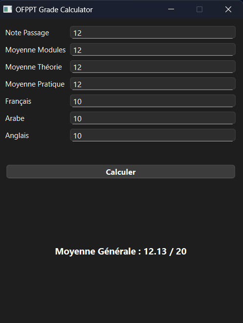

# OFPPT Grade Calculator

**OFPPT Grade Calculator** est une application de bureau légère et  qui permet intuitive de calculer automatiquement la **moyenne générale du diplôme OFPPT**,  
Elle est disponible avec une **interface graphique moderne** (Tkinter ou PyQt).



---

## Fonctionnalités principales

- Calcul précis basé sur les coefficients OFPPT
- Interface graphique (Tkinter ou PySide6 / Qt)
- Prise en compte de la communication (Français, Arabe, Anglais)
- Validation des notes (0–20)
- Prêt pour export CSV / PDF (bientôt disponible)
- Conçu pour un usage local, sans connexion

---

## Installation (Windows)

### 1. Cloner le dépôt

```bash
git clone https://github.com/votre-utilisateur/ofppt-grade-calculator.git
cd ofppt-grade-calculator
```
## Créer un environnement virtuel
```bash
python -m venv venv
venv\Scripts\activate
```
## Installer les dépendances
```bash
pip install -r requirements.txt
```
## pour Lancer l'application
```bash
python main.py # python/python3
```


